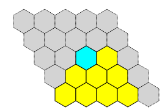

hex-painter
===========

`hex-painter` is a JavaScript library that allows you to "draw" a picture of a
Hex game board by typing ASCII text, like this:

    -     . . . . .
    --     . . . . .
    ---     . . * 0 .
    ----     . 0 0 0 .
    -----     0 0 0 0 .

and then convert it in a web browser, on-the-fly, to produce an SVG image
like this:

What is Hex?
============

Hex is a two-person strategy game played on a diamond-shaped hexagonal grid.

You can read up on it
on [Wikipedia](https://en.wikipedia.org/wiki/Hex_(board_game)
or [MathWorld](http://mathworld.wolfram.com/GameofHex.html).

Like many people, I was introduced to the game by Martin Gardner
in one of his Mathematical Games columns (in my case, via the
book [Hexaflexagons and Other Mathematical Diversions](https://books.google.com/books?id=QpPlxwSa8akC&q=%22The+Game+of+Hex%22#v=snippet&q=%22The%20Game%20of%20Hex%22&f=false)).

The strategy for the game is deep and subtle. It was proven long ago that the
first player has a winning strategy, but nobody has been able to characterize
it any more clearly than "make the right moves."

A large number of scholarly papers have been published on the subject.  Ryan B.
Hayward's [oevre](http://webdocs.cs.ualberta.ca/~hayward/publications.html) is
a good example. I particularly recommend
[Solving 8x8 Hex](http://webdocs.cs.ualberta.ca/~hayward/papers/solve8.pdf).

There's even been [a book](http://www.cameronius.com/games/hex/)
written about Hex strategy.

Examples
========

Hex-painter was created to make it (relatively) easy to illustrate web
pages discussing hex strategy.  You can see it in action on these web pages:

 * [The Hex Board Editor](http://thomboyer.com/hex-painter/board-editor.html)
   describes the mini-language you use to "draw" a game board.  It also
   provides a live editor: a textbox whose board "drawing" is rendered
   immediately, so you can see the resulting SVG image.

 * [Hex Templates](http://thomboyer.com/hex-painter/hex-templates.html)
   shows a collection of "edge templates", which are important patterns that
   crop up repeatedly in games. Each edge template is rendered from a `<pre>`
   text section by hex-painter.

Contents
========

The contents of this repository are as follows:

  * *README.md* - this description
  * *hex-painter.js* - the source code for hex-painter (this is the
    major contribution of this GitHub repository)
  * *board-editor.html* - the source code of 
    [The Hex Board Editor](http://thomboyer.com/hex-painter/board-editor.html)
  * *hex-templates.html* - the source code of 
    [Hex Templates](http://thomboyer.com/hex-painter/hex-templates.html)
  * Support libraries:
  ** *raphael-min.js* - the magical [Raphaël JavaScript
     Library](http://dmitrybaranovskiy.github.io/raphael/) that makes it easy to
     create SVG content on the web
  ** *jquery-1.7.2.min.js - the fast, small, and feature-rich [JavaScript
     library](https://jquery.com/) that simplifies HTML document manipulation
  * *beehive.svg* - the Hex-board picture shown above (generated in
    [The Hex Board Editor](http://thomboyer.com/hex-painter/board-editor.html)
    and then copied into a file)
