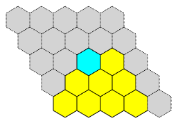

hex-painter
===========

`hex-painter` is a JavaScript library that allows you to "draw" a picture of a
Hex game board by typing ASCII text, like this:

    -     . . . . .
    --     . . . . .
    ---     . . * 0 .
    ----     . 0 0 0 .
    -----     0 0 0 0 .

and then convert it in a web browser, on-the-fly, to produce an SVG image
like this:

What is Hex?
============

Hex is a two-player strategy game played on an N x N diamond-shaped hexagonal
grid, which starts off empty. Each player owns two opposite edges of the
board.  The rules of play are simple:
1. Players take turns placing a piece of their color in an unoccupied cell.
2. The game is won by the player who first forms an unbroken chain of their
   color that connects the two board edges they own.

Despite the simplicity of the rules, the strategy for the game is surprisingly
complex.  It was proven long ago that the first player has a winning strategy,
but nobody has been able to characterize it any more clearly than "make the
right moves."

Martin Gardner introduced the game to many people in his Mathematical Games
column in Scientific American, which is reprinted in the book
[Hexaflexagons and Other Mathematical Diversions](https://books.google.com/books?id=QpPlxwSa8akC&q=%22The+Game+of+Hex%22#v=snippet&q=%22The%20Game%20of%20Hex%22&f=false).
There's also a more recent book devoted entirely to the subject:
[Hex strategy](http://www.cameronius.com/games/hex/), by Cameron Browne.

Online information is available
on [Wikipedia](https://en.wikipedia.org/wiki/Hex_(board_game))
and [MathWorld](http://mathworld.wolfram.com/GameofHex.html).

A large number of scholarly papers have been published about Hex.  Ryan B.
Hayward's [oevre](http://webdocs.cs.ualberta.ca/~hayward/publications.html) is
a good example. I particularly recommend
[Solving 8x8 Hex](http://webdocs.cs.ualberta.ca/~hayward/papers/solve8.pdf).

Examples
========

Hex-painter was created to make it (relatively) easy to illustrate web
pages discussing hex strategy.  You can see it in action on these web pages:

 * [The Hex Board Editor](http://thomboyer.com/hex-painter/board-editor.html)
   describes the mini-language you use to "draw" a game board.  It also
   provides a live editor: a textbox whose board "drawing" is rendered
   immediately, so you can see the resulting SVG image.

 * [Hex Templates](http://thomboyer.com/hex-painter/hex-templates.html)
   shows a collection of "edge templates", which are important patterns that
   crop up repeatedly in games. Each edge template is rendered from a `<pre>`
   text section by hex-painter.

Contents
========

The contents of this repository are as follows:

  * *README.md* - this description
  * *hex-painter.js* - the source code for hex-painter (this is the
    major contribution of this GitHub repository)
  * *board-editor.html* - the source code of 
    [The Hex Board Editor](http://thomboyer.com/hex-painter/board-editor.html)
  * *hex-templates.html* - the source code of 
    [Hex Templates](http://thomboyer.com/hex-painter/hex-templates.html)
  * Support libraries:
  ** *raphael-min.js* - the magical [Raphaël JavaScript
     Library](http://dmitrybaranovskiy.github.io/raphael/) that makes it easy to
     create SVG content on the web
  ** *jquery-1.7.2.min.js - the fast, small, and feature-rich [JavaScript
     library](https://jquery.com/) that simplifies HTML document manipulation
  * *beehive.png* - the Hex-board picture shown above (generated by screen
    capture after generating the picture in
    [The Hex Board Editor](http://thomboyer.com/hex-painter/board-editor.html)
    and then screen-captured)
